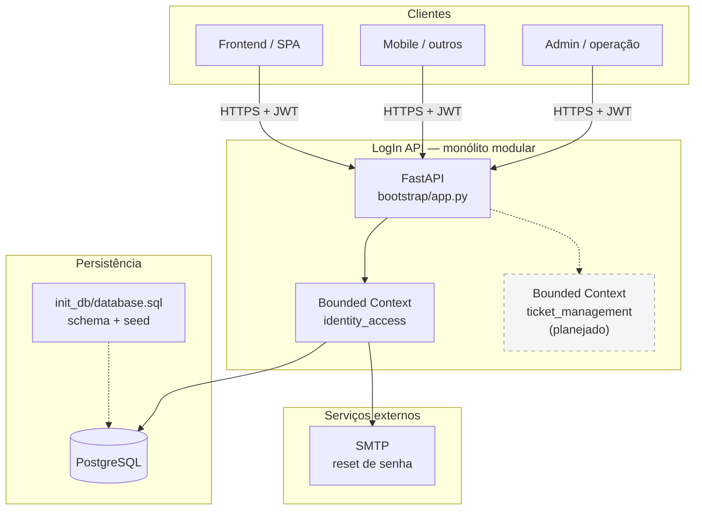
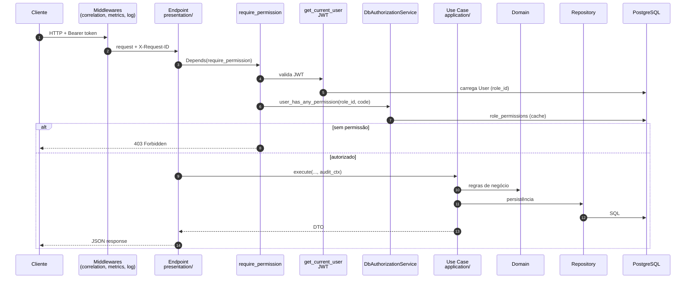
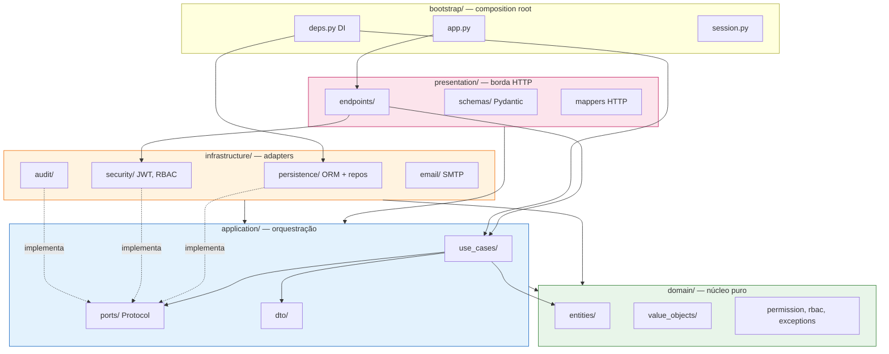
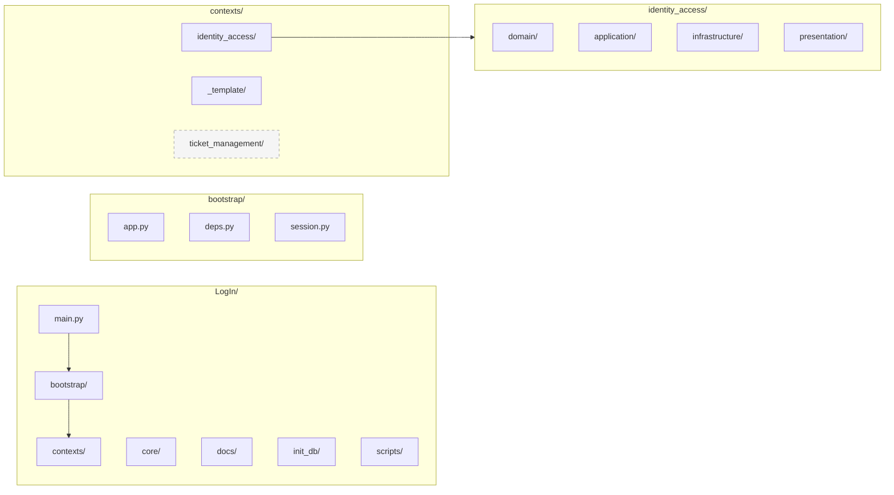
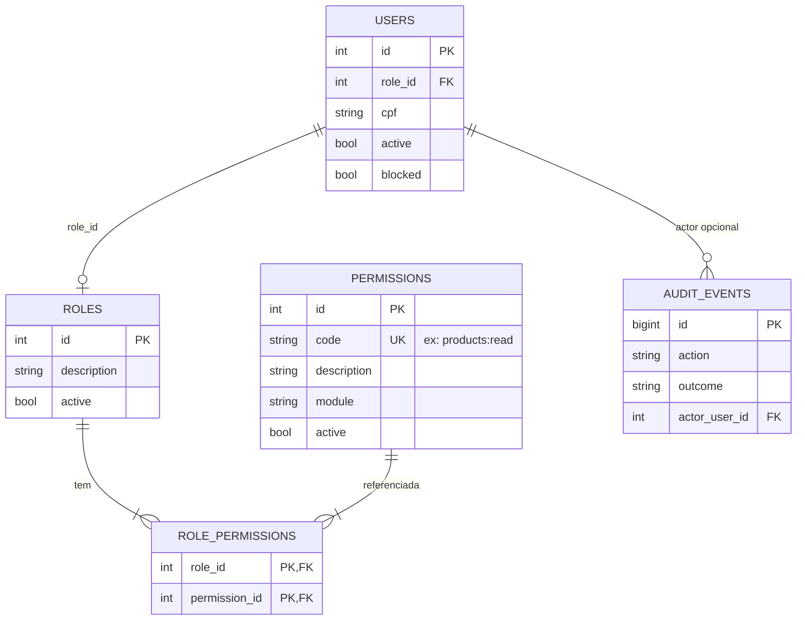
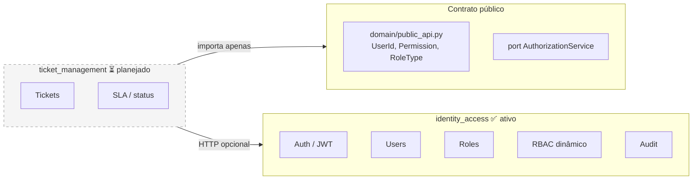
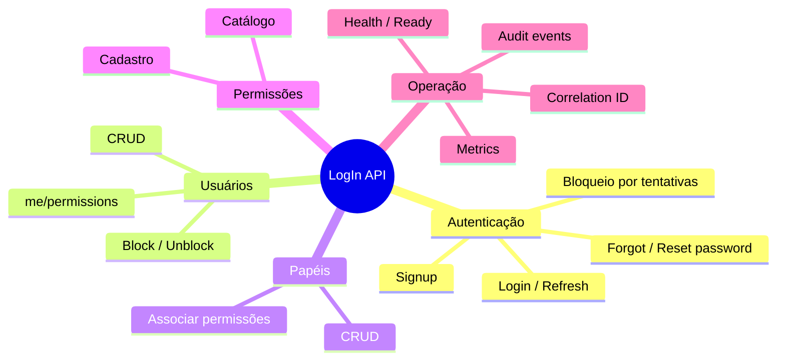
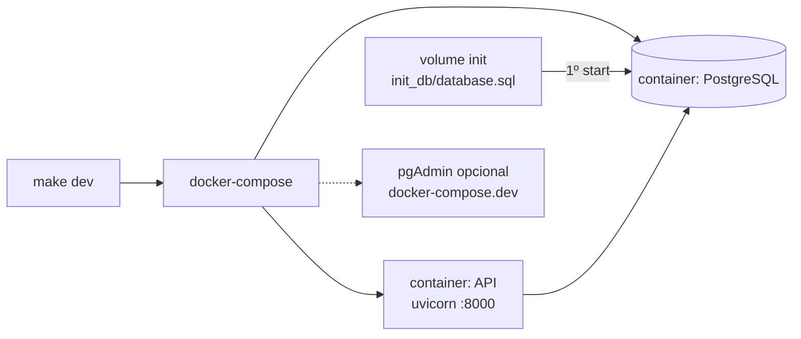

# Visão visual do sistema — LogIn API

Diagramas de alto nível e organização interna.  
Atualize este arquivo quando a arquitetura macro mudar.

---

## 1. Sistema em alto nível

**Papel de cada peça**

| Componente | Função |
|------------|--------|
| **FastAPI** | Porta HTTP única, middlewares, roteamento `/v1/*` |
| **identity_access** | Usuários, papéis, JWT, RBAC dinâmico, auditoria |
| **ticket_management** | Placeholder — futuros tickets/SLA |
| **PostgreSQL** | Dados + catálogo RBAC (`permissions`, `role_permissions`) |
| **SMTP** | E-mail de recuperação de senha (opcional em dev) |

---

## 2. Fluxo de uma requisição protegida

---

## 3. Organização — Clean Architecture (camadas)

**Regra de dependência:** setas apontam **para dentro**. `domain/` não conhece FastAPI nem SQLAlchemy.

---

## 4. Organização — pastas do repositório

---

## 5. RBAC dinâmico — modelo de dados

**Regras**

- Usuário **não** tem permissão direta — herda do **papel** (`role_id`).
- Matriz papel→permissão **só no banco** — não em código Python.
- Admin (`role_id = 3`): bypass em `require_permission` + todas no seed.

---

## 6. Bounded contexts — mapa atual e futuro

Novo módulo: `make new-context NAME=...` → [`contexts/_template/README.md`](../../contexts/_template/README.md)

---

## 7. Módulos funcionais implementados (Identity)

Detalhamento tabular: [`FUNCTIONALITY_CATALOG.md`](../FUNCTIONALITY_CATALOG.md)

---

## 8. Deploy local (Docker)

Reset banco: `make docker-fresh`

---

## Referências

- Manual de fluxos: [`README.md`](../../README.md)
- Catálogo: [`FUNCTIONALITY_CATALOG.md`](../FUNCTIONALITY_CATALOG.md)
- RBAC: [`RBAC.md`](../RBAC.md)
- Regras de camada: [`golden_rules.md`](golden_rules.md)
- Prompt agentes: [`AGENT_IMPLEMENTATION_PROMPT.md`](../../AGENT_IMPLEMENTATION_PROMPT.md)
